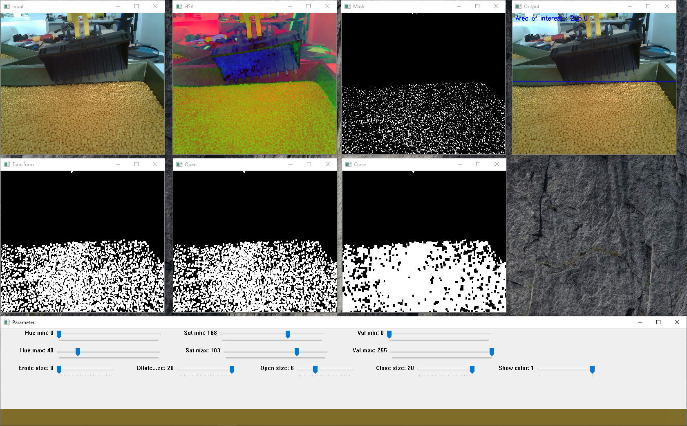

# Image Processing
The repository is about image processing using Python.

## Color segmentation
Filter the range of interested color using HSV format and put a box to the raw image to show the location of that color.
